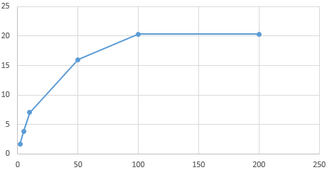

# About

I found <https://github.com/k0rn/last_words/>, which has the last words of
[executed offenders in Texas][source].

The [source][source] also has additional offender information (see [Gregory
Russeau's page][greg]) such as height, occupation, incident information,
photograph, etc. Some are images, though (see [Lester Bower's page][lester].)

This app (for now) re-scrapes the [main page][source] and the linked last
statements into a `deathrow.csv` file. Soon, we may add visuals to this.

[source]: https://www.tdcj.state.tx.us/death_row/dr_executed_offenders.html
[greg]: https://www.tdcj.state.tx.us/death_row/dr_info/russeaugregory.html
[lester]: https://www.tdcj.state.tx.us/death_row/dr_info/bowerlester.jpg

## Setup

- Install [Python 3.4](http://continuum.io/downloads#py34)
- Run `pip install aiohttp`
- Run `python scrape.py`. The results are in `deathrow.csv`.

## Performance notes

[asyncio][asyncio] is beautiful. You can fire 1,000 HTTP requests without
blinking an eye. (I would hesitate to fire 1,000 processes, or even threads.)
Of course, we hit diminishing returns well before then. With 2 requests at a
time, it takes about 5.5 minutes. With 50, it takes just half a minute. Beyond
that, the speed-up is negligible (probably because bandwidth, not latency,
becomes the constraint. After all, we *are* downloading around 5MB, and doing
a bit of lxml processing on top of it.)

[asyncio]: https://docs.python.org/3/library/asyncio.html

      2:   330s
      5:   139s
     10:    75s
     50:    33s
    100:    26s
    200:    26s

The X-axis shows the number of concurrent GET requests. The Y-axis shows the
number of requests processed per second (sort of -- this includes the program
overheads.)

